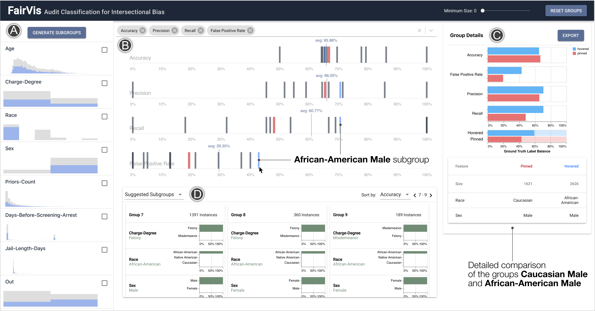

This is a fork! :)  The original work is both: A. awesome and B. double awesome for being shared in the open.  Thanks to @cabreraalex and pals over at https://github.com/poloclub/FairVis :thumbsup

# rambling notes below, beware

## what is this
It's experimenting with the idea that maybe 10% of the time, the humans don't follow the decision of the prediction model.

So as you're working, the decisions will shift around just that little bit.  If you want to intensify the feeling, you can change the red params at the top through the URL's query string.

You can also ask how well this toy, with randomness in 10% of binary decisions that individuals are making, appromixates the complexity of the surrounding sociotechnical context.  Or the potential distribution drift in the deployment environment.

Maybe this influences how any patterns you see here are situated within broader questions of sociotechnical fairness.


## if you like research
Well, you see... human-centered AI ([Vaughan and Wallach 2020](http://www.jennwv.com/papers/intel-chapter.pdf)).

It's hard to design ([Yang et al. 2019](https://dl.acm.org/doi/abs/10.1145/3313831.3376301#.XqgYt7sI0DI.twitter)).

And those pesky humans "do alter their behavior when the tool is deployed" ([De-Arteaga et al. 2020](https://arxiv.org/pdf/2002.08035.pdf)).

Even the "existence of visualizations and the fact that the tools were publicly available led to cases of over-trust and misuse" ([Kaur et al. 2020](http://www.jennwv.com/papers/interp-ds.pdf)).

And the humans were "less likely to adhere to the machine’s recommendation when the score displayed was an incorrect estimate of risk" ([Fogliato et al. 2020](https://www.dropbox.com/s/kyk1067yk6a6yqp/Lessons_from_the_Deployment_of_an_Algorithmic_Tool_in_Child_Welfare.pdf?dl=0)).

Sometime the humans even talk to each other and develop a "general distrust in the existing system [that] contributes significantly to low comfort in algorithmic decision making" ([Brown et al. 2019](https://www.andrew.cmu.edu/user/achoulde/files/accountability_final_balanced.pdf)).

...

But maybe just maybe none of that applies to pre-trial detention (aka COMPASS if you only speak dataset),  oops it is now 30 seconds later and I ran a search on the internet.  And a lot of people have written about pre-trial detention.

Some people even has the zany idea to write a paper called "What Do Criminal Justice Professionals Think About Risk Assessment at Pretrial?" ([DeMichele et al. 2018](https://papers.ssrn.com/sol3/papers.cfm?abstract_id=3168490)).  I mean listen to this:

> We describe findings from surveys with [humans] in 30 jurisdictions about their perceptions and use of risk assessments in making pretrial release decisions.

Definitely not web scale but check what they determined:

> [the humans'] view and use of these tools is critical because there is substantial discretion in whether and how they implement recommendations.

And some other people have found:

>  Several prior studies find that [the humans are] affected by [other humans they talk to]  (Albonetti, 1986, 1987, 1991; Holleran, Beichner, & Spohn, 2010; Miller & Sloan, 1994).

But wait for it, in this survey they did convert it to numbers and I added some bold:

> Finally, respondents were asked about the extent to which they agree with recommendations from the tool and how frequently they use it (Table 5). **Virtually [zero humans] indicated that they “always” or “never” agreed with the PSA recommendation**. Judges (63%) and pretrial staff (72%) were more likely to indicate they agreed with it “often.” Half of defenders and 38% of prosecutors indicated they agree with the recommendation “sometimes.” Nearly one in three prosecutors “rarely” agree with it. This is consistent with earlier results suggesting that judges and pretrial staff saw fewer weaknesses in the DMF than prosecutors and defenders. 

Anyway, so like what if we put a smidge of the uncertainty from ([DeMichele et al. 2018](https://papers.ssrn.com/sol3/papers.cfm?abstract_id=3168490)) into a tool?  Would the map seem so appealing if it were less abstracted from the territory?

...

Humans respond to this differently, and sometimes people have found that "[the humans making the computers] wanted much more information density than [the humans using the computers]" ([Pearce 2020](https://pair-code.github.io/interpretability/uncertainty-over-space/)).

Also this paper is also about pretrial detention, but instead of asking humans it asks simulated human computers on Mechanical Turk ([Green And Chen](https://scholar.harvard.edu/files/19-fat.pdf)).  But still kind of interesting, like, epistimelogically.

And here's ML Cummings on automation bias to close us out, ([2004](https://hal.pratt.duke.edu/sites/hal.pratt.duke.edu/files/u13/Automation%20Bias%20in%20Intelligent%20Time%20Critical%20Decision%20Support%20Systems.pdf)) style:

> Automated decision aids are designed to reduce human error but actually can cause new errors in the operation of a system if not designed with human cognitive limitations in mind.


#### Some other readings
- A Case for Humans-in-the-Loop: Decisions in the Presence of Erroneous Algorithmic Scores ([De-Arteaga et al. 2020](https://arxiv.org/abs/2002.08035))
- Communicating Model Uncertainty Over Space ([Pearce 2020](https://pair-code.github.io/interpretability/uncertainty-over-space/))
- “Hello AI”: Uncovering the Onboarding Needs of Medical
Practitioners for Human–AI Collaborative Decision-Making ([Cai et al. 2019](https://drive.google.com/file/d/1AXzIUMluKZHLjBifctft-VI4CqJiklE2/view))
- Judgemental adjustment of initial forecasts: Its effectiveness and biases ([Lim and O'Connor 1995](https://onlinelibrary.wiley.com/doi/abs/10.1002/bdm.3960080302))
- Human-Centered Tools for Coping with Imperfect Algorithms During Medical Decision Making ([Cai et al. 2019](https://drive.google.com/file/d/12bPGBeVWhlMHT1R7UeQong5Eg1m7Xzk3/view))
- Making sense of recommendations ([Yeomans et el. 2018](https://www.mikeyeomans.info/papers/Making_Sense.pdf))
- Toward Algorithmic Accountability in Public Services:  Qualitative Study of Affected Community Perspectives on AlgorithmicDecision-Making in Child Welfare Services ([Brown et al. 2019](https://www.andrew.cmu.edu/user/achoulde/files/accountability_final_balanced.pdf))
- Will You Accept an Imperfect AI? Exploring Designsfor Adjusting End-user Expectations of AI Systems ([Kocielnik et al. 2019](https://www.microsoft.com/en-us/research/uploads/prod/2019/01/chi19_kocielnik_et_al.pdf))
- What Do Criminal Justice Professionals Think About Risk Assessment at Pretrial? ([DeMichele et al. 2018])(https://papers.ssrn.com/sol3/papers.cfm?abstract_id=3168490)
- Understanding the Effect of Accuracy on Trust inMachine Learning Models ([Yin et al. 2019](https://mingyin.org/CHI-19/accuracy.pdf))
- Intelligible Models for HealthCare: Predicting PneumoniaRisk and Hospital 30-day Readmission ([Caruana et al. 2017](https://www.microsoft.com/en-us/research/wp-content/uploads/2017/06/KDD2015FinalDraftIntelligibleModels4HealthCare_igt143e-caruanaA.pdf))

---
# FairVis: Visual Analytics for Discovering Intersectional Bias in Machine Learning

**FairVis** is a visual analytics system that allows users to audit their classification models for intersectional bias. Users can generate subgroups of their data and investigate if a model is underperforming for certain populations.

* Try a **[live demo](https://poloclub.github.io/FairVis/)**!
* Read the **[full paper](https://arxiv.org/abs/1904.05419)**.
* **[Cite this work and more](https://cabreraalex.com/#/paper/fairvis)**.

**[FairVis: Visual Analytics for Discovering Intersectional Bias in Machine Learning](https://cabreraalex.com/#/paper/fairvis)** 
Ángel Alexander Cabrera, Will Epperson, Fred Hohman, Minsuk Kahng, Jamie Morgenstern, Duen Horng (Polo) Chau
*IEEE Conference on Visual Analytics Science and Technology (VAST). 2019.* 



In this example we show how __FairVis__ can be used on the COMPAS dataset to find significant disparities in false positive rates between African American and Caucasian defendants that are not supported by base rates. The primary components of the system are the following:

__A.__ View distributions of the dataset's features and generate subgroups.

__B.__ Visualize subgroup performance in relation to selected metrics.

__C.__ Compare selected subgroups and view details.

__D.__ Find suggested underperforming subgroups and similar groups.

The full paper, currently under review, can be found [here][paper], detailing the system and use cases.

## Installation

Clone the repository:

```
git clone https://github.com/poloclub/FairVis.git
```

Then initialize the React project by running

```
npm install
```

## Usage

Run the server with

```
npm start
```

## Adding a new dataset

1. Run a model on your data and and create a new file with the last two columns being the output class (between 0-1) of the model and the ground truth labels (0 or 1). Note that only binary classification is currently supported. Examples of models in Jupyter Notebook format can be found in `./models`.

2. Run the `preprocess.py` script on your classified data, e.g. `python3 preprocess.py my-data-with-classes.csv`. Additional options for the helper function can be found using `python3 preprocess.py -h`.

3. Save the processed file to `./src/data/`.

4. Import the file in the `src/components/Welcome.js` component.

5. Add a new row to the table in `Welcome.js` around line `140` in the form of the other datsets.

## Researchers

|  Name                 | Affiliation                     |
|-----------------------|---------------------------------|
| [Ángel Alexander Cabrera][angel]           | Georgia Tech |
| [Will Epperson][will] | Georgia Tech |
| [Fred Hohman][fred]    | Georgia Tech |
| [Minsuk Kahng][minsuk] | Georgia Tech |
| [Jamie Morgenstern][jamie]        | Georgia Tech |
| [Duen Horng (Polo) Chau][polo]             | Georgia Tech |

## Citation
```
@article{cabrera2019fairvis,
  title={FairVis: Visual Analytics for Discovering Intersectional Bias in Machine Learning},
  author={Cabrera, {'A}ngel Alexander and Epperson, Will and Hohman, Fred and Kahng, Minsuk and Morgenstern, Jamie and Chau, Duen Horng},
  journal={IEEE Conference on Visual Analytics Science and Technology (VAST)},
  year={2019},
  publisher={IEEE}
  url={https://cabreraalex.com/#/paper/fairvis}
}
```

## License

MIT License. See [`LICENSE.md`](LICENSE.md).

[paper]: https://arxiv.org/abs/1904.05419 "paper"
[fred]: http://fredhohman.com "Fred Hohman"
[angel]: http://cabreraalex.com/ "Alex Cabrera"
[minsuk]: http://minsuk.com/ "Minsuk Kahng"
[will]: http://willepperson.com/ "Will Epperson"
[jamie]: http://jamiemorgenstern.com/ "Jamie Morgenstern"
[polo]: http://www.cc.gatech.edu/~dchau/ "Polo Chau"
[poloclub]: https://poloclub.github.io
